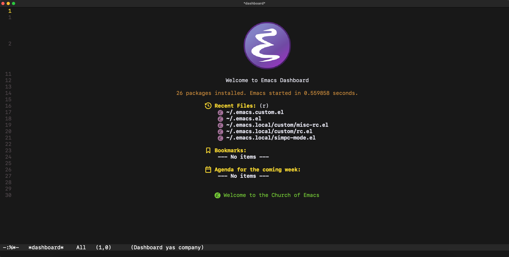

# My Personal Emacs Configuration

This repository contains my minimal (vanilla, plain) personal Emacs 
configuration, with little to no lazy loading (e.g. no use-package), which maximizes 
performanace for Emacs. It has been a blast ride on learning 
Emacs Lisp for myself.

## Dashboard & Other Screenshots




## Get Started

Run the commands below line-by-line.

```console
git clone https://github.com/maux-unix/dotemacs
cd dotemacs
cp -r ./.emacs.{el,custom.el,local} ~
```

After that, you can just open Emacs straight up, and wait for Emacs to download 
& install the packages that it need (It might take awhile, please wait).
After all that, you might want to install the nerd fonts in compilation-mode
by pressing Alt-x or M-x inside Emacs.

```console
M-x nerd-icons-install-fonts
```

## To-do

- [x] Basic, beautiful, sane Emacs Configuration
- [x] (Almost) automatic configuration
- [] Setup sane & complete Code Snippets (YASnippet) 
- [] Make complete & detailed documentation for the configuration

## References

1. daedreth - UncleDavesEmacs: https://github.com/daedreth/UncleDavesEmacs
2. protesilaos - dotfiles/emacs: https://github.com/protesilaos/dotfiles
3. rexim - dotfiles: https://github.com/rexim/dotfiles
